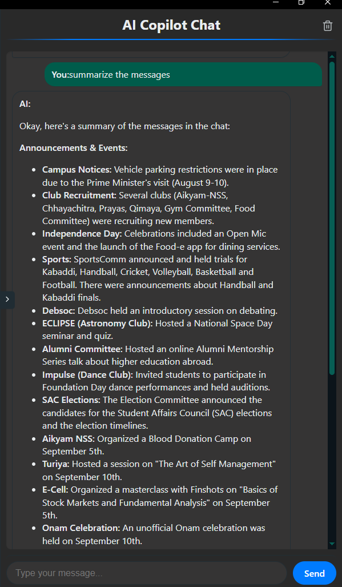

# WhatsApp AI Assistant

This project is an Electron-based desktop application that emulates WhatsApp Web, providing a familiar chat interface with an integrated AI Copilot. It leverages the `baileys` library for WebSocket communication with WhatsApp, a local SQLite database for persistent storage of chat data, and the Google Gemini API for intelligent assistance within the AI Copilot panel.

## Features

*   **WhatsApp Web Emulation:** Connects to WhatsApp via QR code scanning, providing real-time chat synchronization. it has persistent authentication , meaning we dont need to scan qr everytime...
*   **Local Data Storage:** Stores chat, contact, and message data persistently in a local SQLite database using `better-sqlite3`.
*   **Intuitive User Interface:** A React-based frontend with a layout similar to WhatsApp Web, featuring a chat list, conversation view, and an AI Copilot panel.
*   **AI Copilot Integration:** A dedicated panel powered by the Google Gemini API that can "see" messages in the currently active chat.
*   **Function Calling for AI:** The AI Copilot can send messages to active chats by leveraging function calling capabilities.

The added third panel : 



*   **Real-time Message Handling:** Processes new messages and updates the UI in real-time.

## Motivation and Future Plans

The primary motivation behind this project is to enhance the WhatsApp experience by making it more efficient and intelligent. The goal is to streamline various interactions and automate tasks that are currently manual.

**Currently Implemented:**

*   AI Copilot can "see" messages in the active chat.
*   AI Copilot can send messages to active chats using function calling.

**Future Features (Under Development/Planned):**

*   **Calendar Integration:** Seamlessly add extracted dates and events to a calendar.
*   **Scheduled Messages:** Ability to schedule messages to be sent at a later time.
*   **AI Auto-Reply:** Configure AI to automatically reply to messages based on predefined rules or context.
*   **Backend Logic Migration:** Transition all backend logic to a dedicated server to enable scheduled messages and auto-replies without requiring the local device to be online.

## Technologies Used

*   **Frontend:** Electron, React, TypeScript, Zustand (for state management)
*   **Backend (Electron Main Process):** Node.js, TypeScript, `baileys` (for WhatsApp interaction), `better-sqlite3` (for local database), `pino` (for logging)
*   **AI:** Google Gemini API (`@google/genai`)
*   **Database:** SQLite

## Setup/Installation

1.  **Clone the repository:**
    ```bash
    git clone <repository-url>
    cd WhatsappAssistant/electron-app
    ```
2.  **Install dependencies:**
    ```bash
    npm install
    ```
3.  **Set up Google Gemini API Key:**
    Create a `.env` file in the `electron-app` directory and add your Google Gemini API key:
    ```
    VITE_GOOGLE_API_KEY=YOUR_GEMINI_API_KEY
    ```
4.  **Run the application:**
    ```bash
    npm run dev
    ```

## Usage

1.  Upon launching the application, a QR code will be displayed. Scan this QR code using your WhatsApp mobile app to link your account.
2.  Once connected, your chats will be synchronized and displayed in the left panel. for now , after the first sync is complete , you would need to restart the app..
3.  Click on any chat to view the conversation in the middle panel.
4.  The right-hand panel is the **AI Copilot**. Here, you can interact with the AI. The AI will have context of the currently active chat's messages.
5.  You can instruct the AI to send messages to the active chat using natural language, which it will execute via function calling.

## Project Structure (Key Directories/Files)

*   `electron-app/src/main/`: Contains the Electron main process logic, including WhatsApp client (`whatsappClient.ts`), database initialization (`db.ts`), and database queries (`dbQueries.ts`).
*   `electron-app/src/renderer/src/`: Contains the React frontend application.
    *   `electron-app/src/renderer/src/App.tsx`: Main React component, handles WhatsApp connection status and layout.
    *   `electron-app/src/renderer/src/store.ts`: Zustand store for global state management.
    *   `electron-app/src/renderer/src/components/Pane3_AIPanel.tsx`: The AI Copilot panel component, integrating with the Gemini API.
